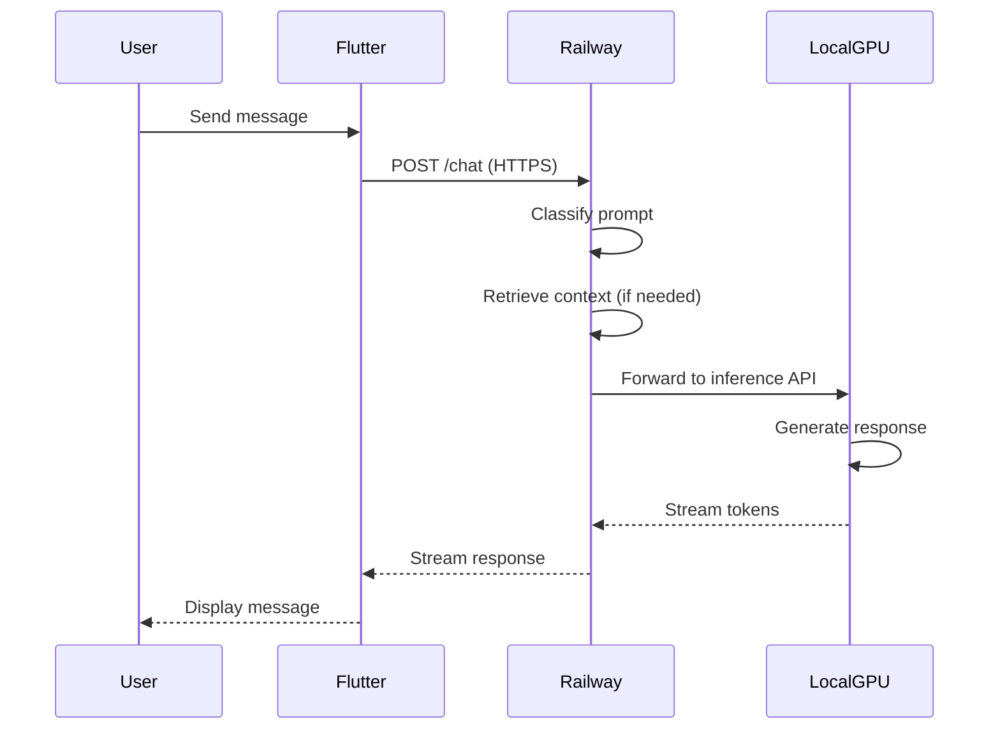
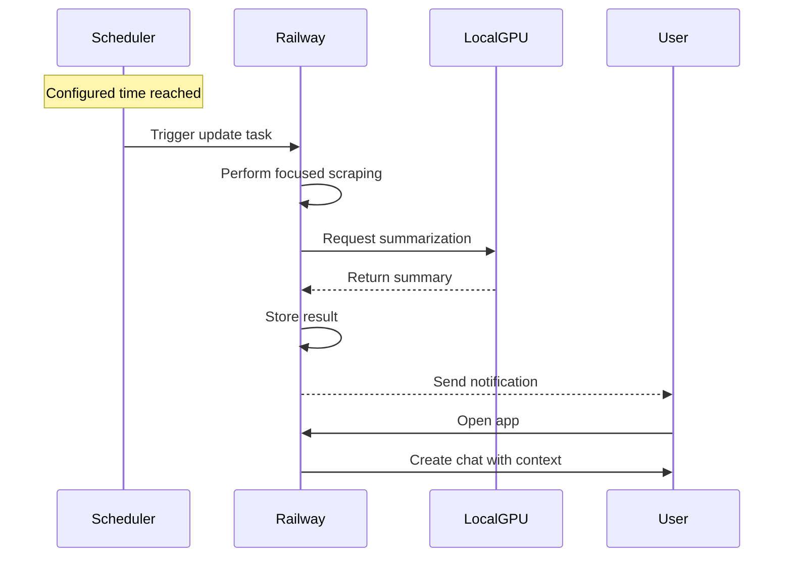

# Aris AI — Hybrid AI Assistant

<p align="center">
  <strong>A ChatGPT-like AI assistant with a split-architecture design</strong><br>
  Cloud orchestration + Local GPU inference = Cost-efficient, responsive AI
</p>

---

## 🎯 Overview

**Aris AI** is a personal AI assistant built with a **hybrid architecture** that separates cloud orchestration from local GPU inference. This design maximizes stability, performance, and cost efficiency by leveraging:

- **Railway (Cloud)** — Lightweight API gateway, orchestration, and state management
- **Local GPU** — Quantized LLM inference on your hardware
- **Flutter** — Cross-platform mobile/desktop client

> 🚀 **Goal**: ChatGPT-like responsiveness without cloud GPU costs

---

## 🏗️ Architecture

```
┌─────────────────────────────────────────────────────────────────────────────┐
│                              ARIS AI SYSTEM                                  │
├─────────────────────────────────────────────────────────────────────────────┤
│                                                                             │
│   ┌───────────────┐         ┌───────────────────┐         ┌──────────────┐ │
│   │               │  HTTPS  │                   │   HTTP  │              │ │
│   │  Flutter App  │ ◄─────► │  Railway Backend  │ ◄─────► │  Local GPU   │ │
│   │  (Frontend)   │         │  (Orchestration)  │         │  (Inference) │ │
│   │               │         │                   │         │              │ │
│   └───────────────┘         └───────────────────┘         └──────────────┘ │
│                                                                             │
│   ► UI Rendering            ► FastAPI Server               ► Ollama Runtime│
│   ► Voice Input            ► Auth & Sessions              ► Quantized LLMs │
│   ► Notifications          ► Prompt Routing               ► GPU Accel.     │
│   ► Biometric Auth         ► Web Scraping                 ► Streaming      │
│                            ► Scheduled Jobs                                │
│                            ► Memory Management                             │
└─────────────────────────────────────────────────────────────────────────────┘
```

---

## 📦 Component Responsibilities

### 1️⃣ Flutter Frontend

| Responsibility   | Description                                |
| ---------------- | ------------------------------------------ |
| UI Rendering     | ChatGPT-like conversational interface      |
| Voice Capture    | Audio recording with waveform animations   |
| Message Handling | Sending/receiving streamed responses       |
| Notifications    | Push notifications for scheduled updates   |
| Personal Space   | Secure vault with biometric authentication |
| Settings         | User preferences and configuration         |

**Tech Stack:**

- Flutter 3.10+ with Dart
- Riverpod (state management)
- Dio (HTTP client)
- Hive (local storage)
- Google Sign-In

### 2️⃣ Railway Backend (Cloud)

| Responsibility        | Description                                |
| --------------------- | ------------------------------------------ |
| API Gateway           | HTTPS endpoints for frontend communication |
| Authentication        | User auth, session management, tokens      |
| Prompt Classification | Categorizing user intent                   |
| Routing Logic         | Deciding which inference source to use     |
| Web Scraping          | Lightweight content retrieval              |
| Scheduled Jobs        | Daily update triggers                      |
| State Management      | Conversation history, memory               |
| Personal Space ACL    | Access control for secure data             |

**What Railway MUST NOT do:**

- ❌ Run large language models
- ❌ Perform GPU-based inference
- ❌ Execute full-precision LLM operations
- ❌ Assume GPU/CUDA availability

> Railway operates as a **control plane**, not a compute engine.

### 3️⃣ Local Inference Node (GPU)

| Responsibility | Description                         |
| -------------- | ----------------------------------- |
| LLM Execution  | Run quantized models (Q4 preferred) |
| Summarization  | Process retrieved content           |
| Reasoning      | Coding, math, explanations          |
| Streaming      | Token-by-token response delivery    |

**Hardware Profile:**

- Windows host
- NVIDIA GTX 1650 (4 GB VRAM)
- Ollama runtime with GPU acceleration

**Constraints:**

- ✅ One model loaded at a time
- ✅ Quantized models only (Q4_K_M recommended)
- ❌ No auth handling
- ❌ No scheduling logic
- ❌ No direct internet exposure

---

## 🔄 Request Flows

### Normal Chat Flow



### Scheduled Daily Updates Flow



---

## 🧠 Quantization Policy

| Aspect      | Requirement                                    |
| ----------- | ---------------------------------------------- |
| Format      | **Q4_K_M preferred** (best quality/VRAM ratio) |
| Requirement | **Mandatory** for local inference              |
| Philosophy  | Optimization, not limitation                   |
| FP16 Models | ❌ Not supported on Railway                    |

**Recommended Models:**

- DeepSeek-R1-Distill 7B Q4
- Llama 3.1 8B Q4_K_M
- Mistral 7B Q4_K_M

---

## 🔌 Pluggable Inference Providers

The backend is designed for inference source flexibility:

| Provider           | Status     | Use Case                   |
| ------------------ | ---------- | -------------------------- |
| Local GPU (Ollama) | ✅ Current | Development, personal use  |
| OpenAI API         | 🔮 Future  | Fallback, premium features |
| Anthropic Claude   | 🔮 Future  | Enhanced reasoning         |
| Groq               | 🔮 Future  | Ultra-fast inference       |
| RunPod / Lambda    | 🔮 Future  | Dedicated GPU cloud        |

> Switching providers requires **zero frontend changes**.

---

## 📁 Project Structure

```
Aris2/
├── frontend/                  # Flutter application
│   ├── lib/
│   │   ├── app/              # App configuration
│   │   ├── core/             # Shared utilities & services
│   │   └── features/
│   │       ├── auth/         # Authentication screens
│   │       ├── chat/         # Chat interface & logic
│   │       ├── media/        # Media handling
│   │       ├── projects/     # Project management
│   │       ├── settings/     # User preferences
│   │       └── vault/        # Personal Space (secure)
│   ├── assets/               # Images, icons, animations
│   └── pubspec.yaml
│
├── backend/                   # FastAPI backend (Railway)
│   └── (TBD)
│
└── inference/                 # Local inference setup
    └── (TBD)
```

---

## 🚀 Getting Started

### Prerequisites

| Component     | Requirement         |
| ------------- | ------------------- |
| Flutter       | 3.10+               |
| Dart          | 3.10+               |
| Node.js       | 18+ (for backend)   |
| Python        | 3.10+ (for backend) |
| Ollama        | Latest              |
| NVIDIA Driver | Latest              |

### Frontend Setup

```bash
cd frontend
flutter pub get
flutter run
```

### Backend Setup (Railway)

```bash
# Coming soon...
```

### Local Inference Setup

```bash
# Install Ollama
# https://ollama.ai/download

# Pull quantized model
ollama pull deepseek-r1:7b-q4_K_M

# Start Ollama server
ollama serve
```

---

## ✅ Success Criteria

| Criterion       | Target                        |
| --------------- | ----------------------------- |
| Responsiveness  | ChatGPT-like feel             |
| Stability       | Works on limited hardware     |
| Cloud Costs     | Minimal (Railway free tier)   |
| AI on Railway   | ❌ None                       |
| Separation      | Orchestration ≠ Computation   |
| Maintainability | Easy to deploy, debug, extend |

---

## 🛣️ Roadmap

- [ ] Phase 1: Core chat functionality
- [ ] Phase 2: Voice input integration
- [ ] Phase 3: Personal Space implementation
- [ ] Phase 4: Daily updates & notifications
- [ ] Phase 5: Multi-provider inference support

---

## 📄 License

This project is proprietary. All rights reserved.

---

<p align="center">
  <em>Built with ❤️ for efficient AI interaction</em>
</p>
